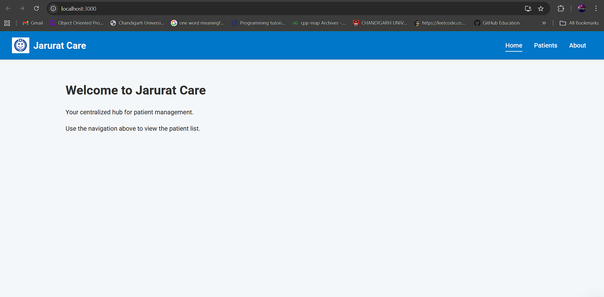
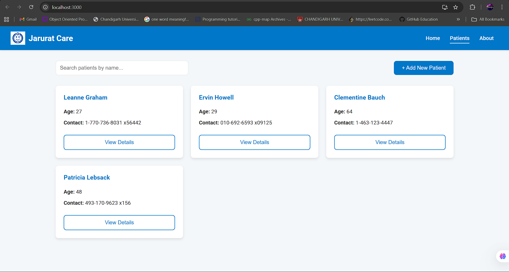
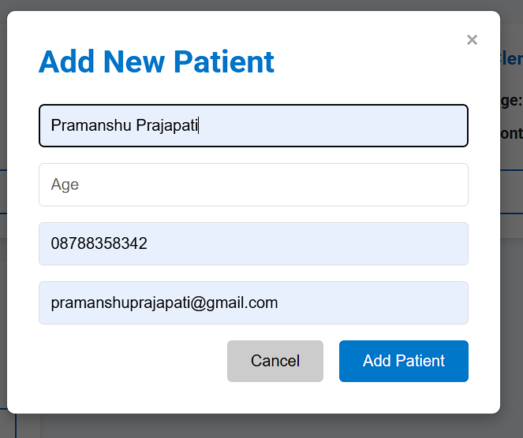
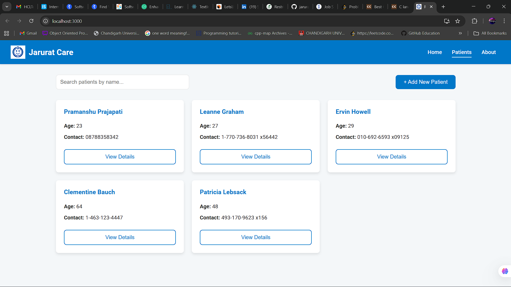

# Jarurat Care - Patient Management System

This is a simple web application for managing patient records. Users can view a list of all patients, add new patients, and search for existing ones.

## Screenshots

Here's a walkthrough of the application's features.

### Welcome Page
The main landing page for the application.


---

### Patients List
Displays a list of all patients. Users can search for patients by name.


---

### Add New Patient
A modal form allows for adding new patients to the system.


---

### Updated Patient List
The patient list view after a new patient has been added.


---

## Project Setup and Installation

Follow these instructions to get a local copy of the project up and running.

### Prerequisites

You need to have Node.js and npm (or yarn) installed on your machine.
* [Node.js](https://nodejs.org/) (which includes npm)

### Installation

1.  **Clone the repository**
    ```sh
    git clone [https://github.com/P01Sensai/jarurat-care-dashboard.git](https://github.com/P01Sensai/jarurat-care-dashboard.git)
    ```

2.  **Navigate to the project directory**
    ```sh
    cd jarurat-care-dashboard
    ```

3.  **Install NPM packages**
    ```sh
    npm install
    ```
    or if you use yarn:
    ```sh
    yarn install
    ```

### Running the Application

After installation, you can run the app in development mode.

```sh
npm start
